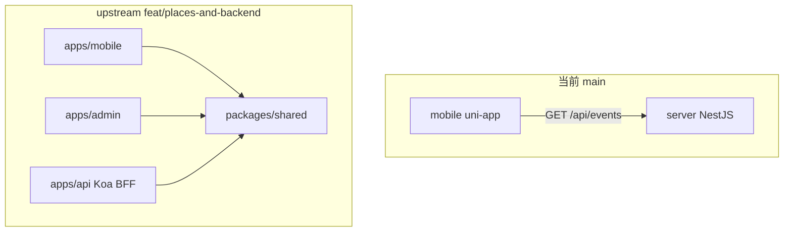
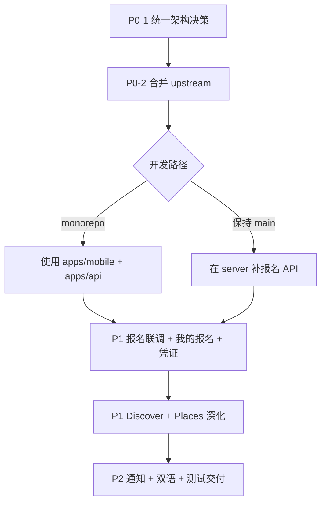

# 成都外籍社区项目总览与后续跟进

> 文档版本：v1  
> 整理范围：当前 `main` 工作区实际代码 + `upstream/feat/places-and-backend` 分支差异  
> 最后更新：2026-06-07

---

## 1. 项目定位

**Chengdu Foreigner Community Program（CFCP）** 是一个面向成都外籍居民的社区服务小程序，社区场景以桐梓林为主。目标能力包括：

| 模块 | 能力 |
|------|------|
| 首页信息流 | 帖子 + 活动卡片、搜索、分类筛选 |
| 本地地标（Places） | 详情、评价、导航、收藏 |
| 社区活动（Events） | 列表、详情、报名、核销、回顾 |
| 社区互动（Discover） | 发帖、评论、点赞、分享 |
| 公告与通知 | 系统 / 互动 / 活动提醒 |
| 管理后台（Admin） | 活动、地点、帖子审核与数据统计 |

技术方向：**uni-app（Vue 3）前端 + 后端 API + 管理后台**，支持微信小程序，可扩展 H5。

---

## 2. 仓库现状：两套架构并存

当前最需要留意的一点：**文档描述的结构**与**本地 `main` 分支实际代码**并不一致；更完整的实现在远程 feature 分支上。

### 2.1 当前 `main` 分支（本地工作区）

```text
.
├── mobile/              # uni-app 小程序前端
├── server/              # NestJS + Prisma 后端
├── README.md
├── 1.md                 # 产品需求详细设计
├── 仓库结构与三人协作说明.md   # 描述 monorepo（但 main 上无 apps/）
├── weekly-plan-mvp-report.md   # 12 周团队计划
├── emma-weekly-plan.md         # Emma 个人计划
├── work-summary-week1-emma.md  # Emma Week 1 总结
├── 志愿者点位采集表-v1.md
├── 点位采集审核与映射说明-v1.md
└── project.config.json         # 微信小程序 AppID
```

- Git 提交极少（`Initial commit` + `hello`）
- 实际为扁平双端：`mobile/` + `server/`
- **无** `apps/`、`packages/`、`admin/` 目录

### 2.2 `upstream/feat/places-and-backend` 分支（更完整）

```text
.
├── apps/
│   ├── mobile/          # uni-app 用户端（events + discover + places）
│   ├── admin/           # Vue 3 + Element Plus 管理后台
│   └── api/             # Koa BFF + mock/cloudbase 双 provider
├── packages/
│   └── shared/          # 三端共享契约、schema、mock service、client
├── docs/                # 项目文档、API 清单、协作说明
├── openspec/            # OpenSpec 变更提案
├── pnpm-workspace.yaml
├── vitest.config.ts
└── package.json         # monorepo 根脚本
```

- 比 `main` 多约 **163 个文件、+22k 行**
- 采用 **pnpm monorepo + contract-first** 架构
- Places 模块、共享契约、API BFF、Admin 后台、测试体系均已落地

### 2.3 架构关系对比



---

## 3. 三人分工（12 周计划）

| 成员 | 模块 | 主责目录 |
|------|------|----------|
| **Emma** | Events | 活动列表 / 详情 / 报名 / 凭证 / 我的报名 |
| **刘知行** | Discover | 帖子流、发帖、点赞评论 |
| **赵冉杰** | Places + API + Shared + Admin | 地标、共享契约、BFF、后台 |

协作原则（来自 `仓库结构与三人协作说明.md`）：

- 跨模块字段改动必须先改 `packages/shared`，再改 `apps/api`，最后改前端
- 共享内容不放应用私有目录
- 每周必须有可演示的 MVP

---

## 4. 当前 `main` 已实现内容

### 4.1 前端 `mobile/`

**技术栈**：uni-app（Vue 3）、Vite、Pinia（已依赖，未接入 `main.ts`）

**页面路由**（`mobile/src/pages.json`）：

| 路径 | 说明 |
|------|------|
| `pages/index/index` | 首页入口，跳转活动模块 |
| `pages/event/list` | 活动列表 |
| `pages/event/detail` | 活动详情 |
| `pages/event/signup` | 活动报名 |

**核心文件**：

| 文件 | 作用 |
|------|------|
| `mobile/src/pages/event/list.vue` | 列表 Tab 筛选、状态展示、空/加载/失败态 |
| `mobile/src/pages/event/detail.vue` | 详情字段完整渲染、跳转报名 |
| `mobile/src/pages/event/signup.vue` | 报名表单骨架（姓名、电话校验） |
| `mobile/src/services/http.ts` | `uni.request` 封装，指向 `http://127.0.0.1:3000/api` |
| `mobile/src/services/event.client.ts` | 列表/详情 client，失败 fallback mock |
| `mobile/src/services/event.mock.ts` | 本地 mock 数据 |
| `mobile/src/types/event.ts` | `EventItem` 类型定义 |

**活动模块完成度**（对照 Week 1–2 目标）：

| 功能 | 状态 |
|------|------|
| 列表 Tab 筛选（全部 / 本周 / 即将开始 / 我的） | 已完成 |
| 详情字段渲染（时间、地点、名额、流程等） | 已完成 |
| 加载 / 错误 / 空状态 | 已完成 |
| 页面跳转链路（列表 → 详情 → 报名） | 已完成 |
| 统一 `event.client` + mock fallback | 已完成 |
| `build:mp-weixin` 构建 | 可构建 |
| 真实报名提交 | 未完成（仅 toast 占位） |
| `isRegistered` 真实数据 | 未完成（恒为 `false`） |
| 首页活动卡片联动 | 未完成 |
| 凭证二维码 / 我的报名 / 活动回顾 | 未开始 |
| discover / places / 通知 / 个人中心 | 无页面 |

### 4.2 后端 `server/`

**技术栈**：NestJS 10、Prisma 6、PostgreSQL

**核心文件**：

| 文件 | 作用 |
|------|------|
| `server/src/main.ts` | 启动，全局前缀 `/api`，`ValidationPipe` |
| `server/src/app.module.ts` | 仅导入 `PrismaModule` + `EventsModule` |
| `server/src/modules/events/events.controller.ts` | Event CRUD 路由 |
| `server/src/modules/events/events.service.ts` | Event 业务逻辑 |
| `server/prisma/schema.prisma` | 完整 Event 数据模型 |

**Prisma 数据模型**（已设计）：

| 模型 | 说明 | API 状态 |
|------|------|----------|
| `Event` | 活动 | CRUD 已实现 |
| `EventRegistration` | 报名（含 `voucherToken`、核销字段） | 表存在，无 API |
| `EventReview` | 活动回顾 | 表存在，无 API |
| `EventNotification` | 通知 | 表存在，无 API |

**已实现 API**：

| 方法 | 路径 | 说明 |
|------|------|------|
| GET | `/api/events` | 列表（含报名数 `_count`） |
| GET | `/api/events/:id` | 详情（含 registrations、reviews） |
| POST | `/api/events` | 创建 |
| PATCH | `/api/events/:id` | 更新 |
| DELETE | `/api/events/:id` | 删除 |

**未实现 API**（README 与 schema 已规划）：

- `POST /events/:id/register` — 报名
- `GET /me/event-registrations` — 我的报名
- `GET /events/:id/voucher` — 凭证二维码
- `GET /events/:id/review` — 活动回顾
- 全部 `/admin/*` 管理端接口
- 核销、通知、并发名额控制
- `auth`、`users`、`posts`、`landmarks`、`announcements` 模块
- JWT、Redis、Swagger、微信登录

### 4.3 文档资产（main 已有）

| 文件 | 内容 | 与代码对齐度 |
|------|------|--------------|
| `README.md` | 产品愿景、技术栈、Event MVP API/模型/里程碑 | 偏规划，后端大部分未落地 |
| `1.md` | 首页、地标、活动等产品详细设计 | 产品需求参考 |
| `仓库结构与三人协作说明.md` | 三人分工、monorepo 规范 | 与 main 目录严重不符 |
| `weekly-plan-mvp-report.md` | 12 周三端周计划 | 团队路线图 |
| `emma-weekly-plan.md` | Emma Events 12 周个人计划 | 个人路线图 |
| `work-summary-week1-emma.md` | Emma Week 1 详细总结 | 与 mobile 代码基本一致 |
| `志愿者点位采集表-v1.md` | places 志愿者采集字段规范 | 纯文档，main 无对应代码 |
| `点位采集审核与映射说明-v1.md` | places 审核入库映射规则 | 纯文档，main 无对应代码 |

### 4.4 进度评估（Emma / Events，对照 12 周计划）

| 周次 | 目标 | main 状态 |
|------|------|-----------|
| Week 1 | 三页骨架 + 跳转 + 空状态 | 已完成 |
| Week 2 | 筛选 + 详情 + 统一 client | 已完成（含 mock fallback） |
| Week 3 | 报名闭环 + 重复报名 | 未开始 |
| Week 4+ | 首页联动、凭证、双语、交付等 | 未开始 |

团队整体（discover、places、admin、shared）在 **main 代码层面基本为零**。

---

## 5. `upstream/feat/places-and-backend` 已实现内容

### 5.1 工程与工作区

| 路径 | 作用 |
|------|------|
| `package.json` | 根脚本：`dev:mobile` / `dev:admin` / `dev:api`、`typecheck`、`test` |
| `pnpm-workspace.yaml` | `apps/*` + `packages/*` |
| `vitest.config.ts` | 根级 Vitest，覆盖 shared 与 api 测试 |
| `tsconfig.base.json` | 严格 TS + `@community-map/shared` 路径别名 |
| `.env.example` | `API_MODE=mock`、`API_BASE_URL`、`CLOUDBASE_ENV_ID` 等 |

架构：**pnpm monorepo + contract-first + mock/cloudbase 双 provider**。

### 5.2 `packages/shared` — 三端契约层

| 模块 | 关键路径 | 内容 |
|------|----------|------|
| Schemas | `src/schemas/places.ts`、`entities.ts`、`common.ts` | places 列表/详情/地图标记响应；查询参数 schema |
| Contracts | `src/contracts/places.ts`、`events.ts`、`discover.ts`、`paths.ts` | 请求方法、路径、请求/响应 schema |
| Mock 业务 | `src/mock/service.ts` | 当前多数接口的实际业务逻辑（内存态） |
| HTTP Client | `src/client.ts` | 类型化 API 客户端，admin/mobile 共用 |
| 测试 | `test/contracts.spec.ts`、`test/client.spec.ts` | 契约稳定性、快照测试 |

设计原则：`shared` 是**唯一字段/契约真源** → api 路由校验 → 前端消费。

### 5.3 `apps/api` — Koa BFF

| 模块 | 关键路径 | 内容 |
|------|----------|------|
| 应用入口 | `src/app.ts` | Koa + 7 个 route 模块，共 **31 个接口** |
| Places 路由 | `src/routes/places.ts` | 公开 list/detail/map-markers + admin CRUD |
| Events 路由 | `src/routes/events.ts` | 列表、详情、报名、票据、管理端 CRUD/核销 |
| Discover 路由 | `src/routes/discover.ts` | 帖子列表、详情、创建、评论、举报 |
| Provider | `src/providers/mock/`、`src/providers/cloudbase/` | `API_PROVIDER=mock|cloudbase` 切换 |

**运行模式差异**：

| 模式 | 说明 |
|------|------|
| `mock` | 默认模式，大多数接口可用 |
| `cloudbase` | places 浏览可用；**admin/places 三个管理接口未实现** |

### 5.4 `apps/admin` — Vue 3 管理后台

| 页面 | 完成度 |
|------|--------|
| `PlacesPage.vue` | 最完整：列表 + 新建/编辑表单（双语、分类、坐标、推荐、状态） |
| `EventsPage.vue` | 轻量 CRUD 草稿 |
| `PostsPage.vue` 等 | 更薄的管理页骨架 |
| `LoginPage.vue` | 登录页 |

技术栈：Vue 3 + Element Plus + Vite，依赖 `workspace:*` 引用 shared。

### 5.5 `apps/mobile` — uni-app 用户端（upstream 版）

相比 main 的 `mobile/`，upstream 版包含更多模块：

| 模块 | 页面 |
|------|------|
| home | 首页 |
| events | 活动列表、详情 |
| discover | 帖子列表、详情、发帖 |
| places | 地点列表、详情、地图、推荐等 |
| more | 语言设置、登录 |

使用 `@community-map/shared` 统一 client，有 `i18n/copy.ts` 双语文案基础。

### 5.6 upstream 文档与测试

| 文件 | 用途 |
|------|------|
| `docs/plan.md` | 12 周交付计划 |
| `docs/仓库结构与三人协作说明.md` | monorepo 分层、三人分工 |
| `docs/已实现API接口清单.md` | 31 接口全量索引 + mock/cloudbase 差异 |
| `docs/社区地图项目-Phase2-详细设计文档.md` | Phase 2 详细设计 |
| `packages/shared/test/` | 契约/schema 回归测试 |
| `apps/api/test/` | HTTP 集成 + CloudBase handler 测试 |

### 5.7 upstream 完成度（相对 plan Week 1–3）

| 项 | 状态 |
|----|------|
| places v1 契约冻结 | 已完成 |
| places list/query 后端 | 已完成 |
| admin places CRUD（mock） | 已完成 |
| mobile places 骨架/列表 v1 | 已完成 |
| events 报名/票据 API（mock） | 已完成 |
| discover 帖子 API（mock） | 已完成 |
| CloudBase 生产化 | 部分完成 |
| admin 非 places 页面深化 | 进行中 |
| 收藏/分享、map 浏览增强 | 计划中 |

---

## 6. 主要差距与风险

| 问题 | 影响 | 涉及分支 |
|------|------|----------|
| **架构分裂** | `mobile/server` 扁平结构 vs `apps/*` monorepo，重复开发风险 | main vs upstream |
| **报名闭环断裂** | 前端报名未调 API，main 后端无报名接口 | main |
| **后端能力单薄** | main 仅 Event CRUD；README 列出的 10+ 模块缺失 | main |
| **其他业务模块空白** | discover、places、公告、消息、管理后台 main 无代码 | main |
| **基础设施缺失** | 无 JWT/微信登录、无 Swagger、无 Redis、无 CI | main |
| **前端工程债** | pinia/i18n/UI 库未接入；API 地址硬编码；uni-app 工具链兼容问题 | main |
| **联调脆弱** | `event.client` 失败即 fallback mock，易掩盖后端未就绪 | main |
| **Mock 与 CloudBase 不对等** | cloudbase 下 admin/places 三接口未实现 | upstream |
| **文档与代码不一致** | 协作文档描述 monorepo，main 实际无对应目录 | main |

---

## 7. 后续需要修改 / 跟进的 Part

### P0 — 必须先做（阻塞后续开发）

| # | Part | 说明 | 负责建议 | 关键路径/动作 |
|---|------|------|----------|---------------|
| 1 | **统一架构方向** | 确认以 `main` 扁平结构还是 upstream monorepo 为准；避免两套并行开发 | 全员 | 决策后 merge `upstream/feat/places-and-backend` 或明确分工 |
| 2 | **合并 upstream 分支** | main 几乎是空壳，feature 分支即项目本体 | 赵冉杰 | `git merge upstream/feat/places-and-backend`，处理 `h.md` 等小冲突 |
| 3 | **活动报名 API（main 路径）** | 若暂不合 monorepo，需在 `server/` 实现报名接口 | Emma + 后端 | `POST /api/events/:id/register`；事务内扣名额；防重复报名 |
| 4 | **活动报名前端联调** | `signup.vue` 从骨架升级为真实提交 | Emma | `mobile/src/pages/event/signup.vue`、`event.client.ts` 新增 `registerEvent()` |
| 5 | **用户身份占位** | 「我的」Tab、`isRegistered` 需要 userId | 赵冉杰 | JWT 或微信 openId 最小方案；请求头携带用户标识 |

### P1 — 下一阶段（Week 3–6 目标）

| # | Part | 说明 | 负责建议 | 关键路径/动作 |
|---|------|------|----------|---------------|
| 6 | **我的报名列表** | 用户查看已报名活动及状态 | Emma | 前端新页 + `GET /me/event-registrations` 或 upstream `GET /events/me/registrations` |
| 7 | **活动凭证二维码** | 报名成功后展示核销凭证 | Emma | 凭证页 + `GET /events/:id/voucher` 或 upstream 票据接口 |
| 8 | **管理端活动核销** | 后台扫码核销、幂等处理 | 赵冉杰 | upstream 已有 `POST /admin/events/:id/checkin` mock 实现，需对接真实场景 |
| 9 | **首页活动卡片联动** | 首页信息流嵌入活动卡片并跳转详情 | Emma | `mobile/src/pages/index/index.vue` 或 upstream `pages/home/index.vue` |
| 10 | **CloudBase admin/places 补齐** | cloudbase 模式下管理端 places 三接口未实现 | 赵冉杰 | `apps/api/src/providers/cloudbase/index.ts` |
| 11 | **环境配置规范化** | API 地址、provider 模式不应硬编码 | 全员 | `mobile/.env.development`、`VITE_API_BASE_URL`；upstream 已有 `apps/mobile/src/config/env.ts` |
| 12 | **Discover 模块** | 帖子流、发帖、点赞评论 | 刘知行 | upstream 已有 API 骨架；main 需从零或 merge 后接入 |
| 13 | **Places 模块深化** | 地标列表、详情、地图浏览 | 赵冉杰 | upstream places 页面 + 志愿者采集数据入库流程 |

### P2 — 后续增强（Week 7–12 目标）

| # | Part | 说明 | 负责建议 |
|---|------|------|----------|
| 14 | 活动边界态完善 | 满员/已结束/取消 UI 与按钮禁用 | Emma |
| 15 | 活动通知 | 报名成功、开始前、变更提醒 | Emma + 赵冉杰 |
| 16 | 活动回顾 | 结束后图文/视频回顾页 | Emma |
| 17 | 双语适配（i18n） | events/discover/places 中英文切换 | 全员 |
| 18 | Admin 非 places 页面深化 | events/posts/announcements 管理功能补齐 | 赵冉杰 |
| 19 | 性能优化 | 列表分页、骨架屏、接口缓存 | 全员 |
| 20 | 测试与 CI | 契约测试、API 集成测试、提测回归 | 赵冉杰 |
| 21 | 文档对齐 | 将 `仓库结构与三人协作说明.md` 与真实目录对齐；README 指向 `docs/` | 全员 |
| 22 | uni-app 工具链修复 | 依赖版本兼容，dev server 稳定启动 | Emma |
| 23 | 志愿者点位数据入库 | 按 `志愿者点位采集表-v1.md` 审核后导入 places | 赵冉杰 + 运营 |

---

## 8. 推荐执行顺序



**若团队确认以 monorepo 为准**，建议优先 merge upstream，Emma 的活动工作迁移到 `apps/mobile/src/pages/events/`，直接复用 upstream 已实现的报名/票据 API mock，可跳过 main 上 `server/` 的重复开发。

**若团队暂保持 main 扁平结构**，则按 P0 #3–#5 在 `server/` + `mobile/` 内独立完成报名闭环，但需接受与 upstream 的持续分叉风险。

---

## 9. 关键文件速查

### 当前 main

| 类别 | 路径 |
|------|------|
| 项目说明 | [README.md](../README.md) |
| 协作规范（待对齐） | [仓库结构与三人协作说明.md](../仓库结构与三人协作说明.md) |
| 团队 12 周计划 | [weekly-plan-mvp-report.md](../weekly-plan-mvp-report.md) |
| Emma 周总结 | [work-summary-week1-emma.md](../work-summary-week1-emma.md) |
| 活动列表页 | [mobile/src/pages/event/list.vue](../mobile/src/pages/event/list.vue) |
| 活动 API client | [mobile/src/services/event.client.ts](../mobile/src/services/event.client.ts) |
| 后端入口 | [server/src/main.ts](../server/src/main.ts) |
| 数据模型 | [server/prisma/schema.prisma](../server/prisma/schema.prisma) |
| places 运营文档 | [志愿者点位采集表-v1.md](../志愿者点位采集表-v1.md) |

### upstream 分支（merge 后可用）

| 类别 | 路径 |
|------|------|
| 共享契约 | `packages/shared/src/contracts/` |
| API 路由 | `apps/api/src/routes/` |
| API 清单文档 | `docs/已实现API接口清单.md` |
| Admin 地点管理 | `apps/admin/src/pages/PlacesPage.vue` |
| Mobile 活动页 | `apps/mobile/src/pages/events/` |
| 12 周计划 | `docs/plan.md` |

---

## 10. 总结

| 维度 | 当前 main | upstream feature |
|------|-----------|------------------|
| 架构 | `mobile/` + `server/` 扁平 | pnpm monorepo |
| Events 前端 | 列表/详情/报名骨架，mock fallback | 更完整页面 + shared client |
| Events 后端 | 仅 CRUD | 报名/票据/核销 mock 已实现 |
| Places | 仅运营文档 | 契约 + API + admin + mobile 页面 |
| Discover | 无 | API + mobile 页面骨架 |
| Admin | 无 | Vue 3 后台，places 最完整 |
| 测试 | 无 | 契约测试 + API 集成测试 |

**当前 main 处于 Events 模块 MVP 早期**；**upstream 分支已具备 monorepo 全栈骨架**。下一步最关键是 **P0：统一架构并 merge upstream**，然后按 Week 3 目标打通 **活动报名闭环**。
