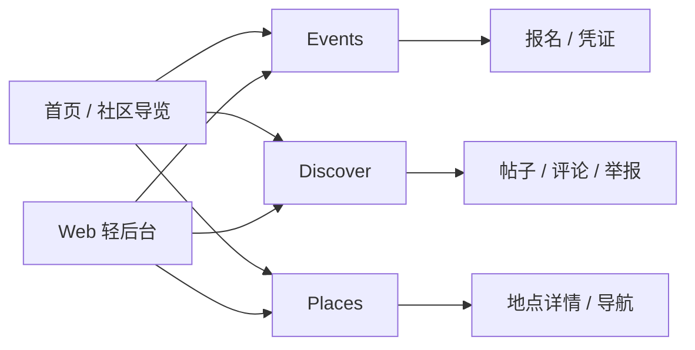
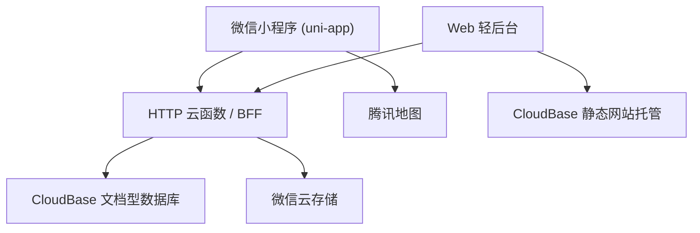

# 社区地图项目 Phase 2 详细设计文档

> 文档状态：V1.2  
> 编写日期：2026-03-23  
> 文档形态：正式交付版 Markdown  
> 适用范围：桐梓林社区微信小程序 + Web 轻后台 + CloudBase 云开发环境  
> 说明：本版依据 2026-03-23 会议结论重写，正式方案调整为 `events`、`discover`、`places` 三个平级模块，并统一采用 `uni-app + TDesign MiniProgram + 腾讯地图 + CloudBase 文档型数据库 + 微信云存储 + HTTP 云函数/BFF + Web 轻后台` 技术路线。

## 一、文档概述

### 1.1 项目背景

社区地图项目在上一版设计中更多从“活动闭环优先、后端独立服务优先”的角度展开，但当前项目的真实推进条件已经变化：

- 仓库内已有基础目录骨架，但尚未形成稳定可联调的业务实现
- 团队希望三个业务模块在同一项目内并行推进，而不是继续围绕单一模块排优先级
- 团队更倾向选择对微信生态、AI 辅助开发和快速试错更友好的技术栈
- 当前项目只服务桐梓林社区，不以多社区平台化作为本期目标

因此，V1.2 的重点不是在 V1.1 上继续做局部补丁，而是基于最新会议结论重新统一产品、协作与技术口径。

### 1.2 V1.2 更新目标

V1.2 需要完成以下四件事：

1. 将产品能力正式收束为 `events`、`discover`、`places` 三大平级模块。
2. 将技术路线正式切换为微信云开发生态，统一数据库、存储与 API 方案。
3. 将团队分工写到目录级别，确保模块并行开发时边界清楚。
4. 将志愿者可参与的任务整理为明确清单，支撑后续地标采集、内容补充和社区冷启动。

### 1.3 产品定位

社区地图 Phase 2 在 V1.2 中定位为：面向桐梓林社区的轻量化本地生活与社区信息产品，通过活动、社区内容和地点信息三条线并行建设，形成“可浏览、可参与、可补充、可维护”的社区数字入口。

本期不再强调“先做一个通用平台，再寻找落地社区”，而是明确以桐梓林社区为唯一服务对象，先把真实社区场景跑通。

### 1.4 核心目标

1. 建立三大模块的基础可用版本：`events`、`discover`、`places` 均能独立访问、独立维护、独立演示。
2. 打通统一技术底座：小程序、Web 轻后台、数据库、文件存储、地图和 API 均在微信生态内协同。
3. 建立稳定协作边界：前端页面、后台页面、HTTP 云函数/BFF、数据集合、文件路径规则可被不同成员并行消费。
4. 保留双语能力：桐梓林社区正式内容继续按中英双字段维护。
5. 形成冷启动支撑：具备首批活动、帖子、地点和志愿者任务清单。

### 1.5 交付边界

本期正式交付包括：

- 微信小程序前台：`events`、`discover`、`places` 三主模块及通用页面
- Web 轻后台：活动、帖子、地点、公告和基础配置管理
- 统一 API 层：基于 CloudBase `HTTP 云函数/BFF`
- 数据存储：CloudBase 文档型数据库
- 文件存储：微信云存储
- 地图能力：腾讯地图
- 社区基础运营：公告、双语内容、志愿者任务清单、首批演示数据

以下内容不作为本期正式交付目标：

- 多社区切换与多租户隔离
- 支付、退款、收费票种
- 复杂推荐算法、复杂搜索排序
- 自建独立服务器集群
- 延续旧版独立数据库与独立后端作为当前正式主方案

### 1.6 设计原则

- 三模块平级推进，不再将单一模块定义为唯一主心骨
- 前台与后台均通过统一 API 层访问业务数据，不直接写核心业务库
- 技术方案优先服从“易实现、易排错、易被团队复用”
- 正式内容保留双语双字段，UGC 保留用户原语言
- 文件存储采用公私分层，避免将敏感文件长期暴露为公开资源
- 先跑通桐梓林社区的真实使用闭环，再讨论平台化抽象

### 1.7 当前仓库与协作前提

当前仓库已经具备基础目录骨架：

- `apps/mobile/src/pages/events`
- `apps/mobile/src/pages/discover`
- `apps/mobile/src/pages/places`
- `apps/api/src/events`
- `apps/api/src/posts`
- `apps/api/src/announcements`
- `apps/api/src/places`
- `apps/api/src/auth`
- `apps/api/src/notifications`
- `apps/api/src/admin`
- `apps/api/src/shared`
- `apps/admin/src`

这意味着 V1.2 文档需要以“已有骨架、尚待完善实现”的现实状态来设计，而不是继续按照“从零搭建完整独立后端”的思路编写。

## 二、V1.2 关键决策结论

### 2.1 产品与协作决策

#### 2.1.1 三模块平级推进

V1.2 正式确认以下三个业务模块为平级核心模块：

- `events`：社区活动、报名、凭证、核销
- `discover`：社区内容流、帖子、评论、互动
- `places`：社区地点、地图展示、导航、基础评价信息

这三个模块都属于本期核心，不再使用“一个模块主导、另外两个模块辅助”的表述。

#### 2.1.2 项目仅服务桐梓林社区

V1.2 明确本项目只为桐梓林社区开发，不在正文中将“多社区平台化”写为当前正式目标。设计中可以保留社区标识字段与扩展位，但当前所有交付和验收都围绕单社区展开。

#### 2.1.3 小程序采用“三主模块 + 通用页”结构

小程序一级结构调整为：

- `Events`
- `Discover`
- `Places`
- 通用页面：首页/社区导览、登录、个人中心、通知中心、语言设置、搜索等

V1.1 中以 `More` 作为一级重点入口的表述，在 V1.2 中不再作为信息架构主轴。

#### 2.1.4 团队分工与目录归属

| 负责人 | 业务归属 | 主负责目录 | 协作说明 |
| --- | --- | --- | --- |
| Emma | `events` | `apps/mobile/src/pages/events` | 负责活动前台页面与交互，按既定 API 接口联调 |
| 刘知行 | `discover` | `apps/mobile/src/pages/discover` | 负责内容流与发帖前台页面，按既定 API 接口联调 |
| 赵冉杰 | `places + 全局后端` | `apps/mobile/src/pages/places`、`apps/api/src/**` | 负责地点模块前台、统一 API 层、数据模型与后台支撑 |

共享协作规则：

- `apps/mobile/src/api`、`apps/mobile/src/types`、`apps/mobile/src/stores` 属于共享层，字段变更必须先更新接口契约
- `apps/admin/src` 作为统一轻后台，不按模块拆成独立项目
- `apps/api/src/events` 对应活动业务接口
- `apps/api/src/posts` 与 `apps/api/src/announcements` 共同支撑 `discover`
- `apps/api/src/places` 对应地点业务接口
- `apps/api/src/auth`、`apps/api/src/notifications`、`apps/api/src/admin`、`apps/api/src/shared` 作为共用基础层

### 2.2 技术路线决策

#### 2.2.1 前端采用 uni-app

前端正式采用 `uni-app + Vue 3 + TypeScript`。主要原因如下：

- 与微信小程序目标形态贴合
- 对 AI 辅助开发更友好，组件、页面和接口调用模式更统一
- 后续若需要补 Web/H5 页面，有更好的跨端复用空间

#### 2.2.2 主数据库选择 CloudBase 文档型数据库

经调查 CloudBase 官方文档，云开发环境内可以同时提供文档型数据库、MySQL 型数据库等多种方案，但 V1.2 的正式结论是：

- 当前主业务库采用 CloudBase 文档型数据库
- 不采用 CloudBase MySQL 作为当前默认方案
- 当前正式方案统一为 CloudBase 文档型数据库

选择文档型数据库的原因：

- 更适合当前“模块并行、结构仍在快速收敛”的阶段
- 正式内容、帖子、地点、活动等对象都适合用 JSON 文档表达
- 与认证、云函数、云存储、HTTP 访问服务同生态，部署与排错成本更低
- 更符合当前团队先跑通业务再做深度建模的节奏

#### 2.2.3 CloudBase MySQL 与 PostgreSQL 的位置

CloudBase MySQL 与 `PostgreSQL` 在 V1.2 中都不作为本期正式路径，但需要在文档中留出判断依据：

| 方案 | 本期结论 | 保留原因 |
| --- | --- | --- |
| CloudBase 文档型数据库 | 当前正式方案 | 与当前团队节奏、三模块结构和云开发生态最匹配 |
| CloudBase MySQL | 当前不采用 | 若后期出现更重的 SQL 报表、复杂关联查询，可再评估 |
| PostgreSQL | 长期备选 | 若后期需要独立部署、跨系统集成、复杂分析型查询，可再评估迁移 |

#### 2.2.4 微信云存储作为正式文件方案

V1.2 正式采用微信云存储，不再把“本地文件存储”写为当前默认方案。

云存储承担以下文件：

- 活动封面
- 地点图集
- 帖子图片
- 公告图片
- 二维码凭证图片
- 导出文件
- 其他管理后台上传附件

#### 2.2.5 API 层统一定义为 HTTP 云函数/BFF

`apps/api` 在 V1.2 中正式定义为 CloudBase `HTTP 云函数/BFF` 层，而非传统独立后端服务。其职责包括：

- 登录与用户态封装
- 小程序业务 API
- Web 轻后台 API
- 模块级权限校验
- 文件路径分配与文件访问控制
- 二维码凭证生成与绑定
- 导出、审核、通知等需要集中规则的逻辑

#### 2.2.6 Web 轻后台优先使用 CloudBase 同生态托管

`apps/admin` 作为统一轻后台，优先部署到 CloudBase 静态网站托管。这样前台、后台、数据库、云函数、文件存储和 HTTP 域名都保持同生态，降低环境切换和运维复杂度。

## 三、产品定位与目标用户

### 3.1 用户角色定义

#### 3.1.1 普通用户

能力范围：

- 浏览 `events`、`discover`、`places`
- 收藏活动、帖子、地点
- 评论、举报、分享
- 报名活动并查看二维码凭证
- 发布帖子
- 查看公告与通知

#### 3.1.2 活动发起人

能力范围：

- 提交活动草稿
- 上传活动封面与双语内容
- 查看活动审核状态
- 查看报名名单
- 发起现场核销协助

活动发起人仍采用普通用户账号扩展模式，不引入独立账号体系。

#### 3.1.3 社区管理员

能力范围：

- 审核活动
- 管理帖子与评论
- 管理地点与公告
- 维护双语内容
- 查看导出记录与操作日志

#### 3.1.4 系统管理员

能力范围：

- 管理后台角色与权限
- 维护接口配置、标签、分类、通知模板
- 管理存储规则、云函数环境配置与系统级日志

### 3.2 核心用户诉求

#### 3.2.1 普通用户诉求

- 快速知道社区近期有哪些活动
- 能看到真实、有帮助的社区帖子
- 能通过地点页获得可决策的信息，而不是只有坐标
- 在中英双语环境下不迷失

#### 3.2.2 活动发起人诉求

- 能方便创建和修改活动
- 审核状态清楚
- 报名名单和核销逻辑简单可用
- 封面、详情、二维码等文件不需要自己额外维护

#### 3.2.3 社区管理员诉求

- 有一个可快速上手的统一轻后台
- 能审核、下架、编辑、导出并保留留痕
- 能维护首批社区内容，而不需要依赖复杂独立系统

### 3.3 关键使用场景

#### 3.3.1 用户报名活动

用户浏览活动列表或首页推荐，进入详情页后完成登录、填写主报名人与同行信息、提交报名，系统生成二维码凭证并存储到云存储，用户在“我的报名”或凭证页查看二维码。

#### 3.3.2 用户发布社区帖子

用户在 `discover` 中发帖，可填写标题、正文、图片、位置和标签。帖子发布后默认进入可见状态，但可被举报、隐藏或删除。

#### 3.3.3 用户浏览地点并导航

用户在 `places` 浏览分类和地图点位，查看图片、营业时间、地址、双语简介和评价信息，随后跳转腾讯地图导航。

#### 3.3.4 管理员维护后台内容

管理员在 Web 轻后台统一管理活动、地点、帖子、公告和文件，所有修改都通过 BFF 落库并记录日志。

## 四、信息架构与协作边界

### 4.1 一级信息架构

V1.2 推荐信息架构如下：

- 首页/社区导览
- `Events`
- `Discover`
- `Places`
- 通用页：登录、通知中心、我的报名、我的收藏、我的帖子、语言设置、活动提交等

首页不承担“万能门户”职责，主要承担社区导览与三大模块分流。

### 4.2 首页结构

首页建议只承接以下高价值内容：

- 桐梓林社区标题区与双语切换
- 今日/本周活动卡片
- 社区公告
- 热门帖子
- 推荐地点
- 志愿者入口或任务入口

### 4.3 仓库目录与模块边界

#### 4.3.1 小程序前台

- `apps/mobile/src/pages/events`：活动列表、详情、报名、凭证
- `apps/mobile/src/pages/discover`：内容流、发帖、帖子详情
- `apps/mobile/src/pages/places`：地点列表、地图、详情
- `apps/mobile/src/pages/more`：通用页承载层，可保留但不再作为主模块表达

#### 4.3.2 HTTP 云函数/BFF

- `apps/api/src/events`：活动查询、创建、审核、报名、核销
- `apps/api/src/posts`：帖子、评论、举报
- `apps/api/src/announcements`：公告与社区信息聚合
- `apps/api/src/places`：地点 CRUD、分类、推荐
- `apps/api/src/auth`：登录、用户身份、权限信息
- `apps/api/src/notifications`：站内通知、可选消息扩展
- `apps/api/src/admin`：后台统一接口聚合
- `apps/api/src/shared`：公共 DTO、校验、错误码、存储工具

#### 4.3.3 Web 轻后台

- `apps/admin/src/pages`：活动、帖子、地点、公告、志愿者任务、操作日志等页面
- `apps/admin/src/api`：后台统一接口层
- `apps/admin/src/types`：后台表单与表格类型定义

### 4.4 核心链路

#### 4.4.1 活动链路

`活动创建 -> 管理员审核 -> 活动上架 -> 用户报名 -> 生成二维码凭证 -> 后台核销`

#### 4.4.2 Discover 链路

`用户发帖 -> 内容展示 -> 评论/收藏/举报 -> 后台治理`

#### 4.4.3 Places 链路

`地点录入 -> 图片上传 -> 前台展示 -> 地图查看 -> 导航跳转 -> 用户补充反馈`

#### 4.4.4 文件链路

`发起上传申请 -> BFF 校验业务权限并分配 cloudPath -> 文件上传到云存储 -> BFF 绑定 fileID -> 前台按权限展示`

### 4.5 模块关系示意

## 五、功能详细设计

### 5.1 Events 模块

#### 5.1.1 模块定位

`Events` 负责承接社区活动信息、报名和核销，是社区线下连接的关键能力，但在 V1.2 中不再被定义为唯一优先模块，而是与 `discover`、`places` 并行建设。

#### 5.1.2 前台用户功能

- 浏览活动列表
- 按时间、标签、状态筛选
- 查看活动详情
- 支持代多人报名
- 查看我的报名
- 查看二维码凭证
- 取消报名
- 分享活动

#### 5.1.3 活动发起人与后台功能

- 创建活动草稿
- 上传封面图
- 维护中英双语标题与内容
- 提交审核
- 查看审核状态与驳回原因
- 查看报名名单
- 导出报名名单
- 后台核销

#### 5.1.4 文件与数据要求

- 活动封面图使用云存储公开资源
- 二维码凭证图片使用云存储私有资源
- 报名导出文件使用云存储私有资源
- 报名逻辑使用“主报名记录 + 参与人明细”模型

### 5.2 Discover 模块

#### 5.2.1 模块定位

`Discover` 负责社区内容流、经验分享和邻里互助，是社区日常活跃度的主要来源。

#### 5.2.2 前台用户功能

- 浏览内容流
- 按标签筛选
- 发布帖子
- 上传图片
- 绑定位置
- 评论、收藏、举报、分享

#### 5.2.3 后台功能

- 查看帖子列表
- 隐藏或删除违规帖子
- 管理评论与举报
- 管理推荐帖子

#### 5.2.4 内容要求

- 帖子可保留原语言
- 标签体系需支持社区生活、活动、求助、二手、餐饮、国际交流等方向
- 图片属于公开资源，但发帖人与后台的业务绑定必须通过 BFF 完成

### 5.3 Places 模块

#### 5.3.1 模块定位

`Places` 负责承接社区地点、地标、商户与公共设施信息，是地图能力与社区内容结合的基础。

#### 5.3.2 数据来源策略

采用“人工运营录入 + 腾讯地图 POI 辅助补充”的模式：

- 社区核心点位由后台人工维护
- 可记录腾讯地图 `poi_id` 或等价外部引用，便于后续校对
- 人工维护内容优先级高于第三方补充信息

#### 5.3.3 前台用户功能

- 浏览地点列表
- 地图展示
- 查看地点详情
- 收藏与分享
- 跳转腾讯地图导航

#### 5.3.4 后台功能

- 新增/编辑地点
- 上传地点图集
- 维护中英双语简介
- 管理分类、标签、推荐位

### 5.4 桐梓林社区信息与公告

#### 5.4.1 模块定位

由于当前项目只服务桐梓林社区，公告与社区信息不再单独抽象为“多社区专区系统”，而是作为社区导览页和后台公告能力的一部分。

#### 5.4.2 前台能力

- 公告列表与详情
- 社区说明
- 推荐活动、推荐帖子、推荐地点聚合

#### 5.4.3 后台能力

- 发布和编辑公告
- 维护导览页推荐位
- 维护社区介绍中英双语内容

### 5.5 个人中心与通知

用户侧通用能力建议包含：

- 我的报名
- 我的二维码凭证
- 我的收藏
- 我的帖子
- 通知中心
- 语言切换
- 活动发起入口

### 5.6 Web 轻后台

后台统一提供以下能力：

- 活动管理与审核
- 帖子、评论、举报治理
- 地点管理
- 公告管理
- 文件查看与回溯
- 志愿者任务配置
- 操作日志查看

## 六、页面与交互设计要点

小程序端 UI 组件库统一采用 TDesign MiniProgram。页面布局、按钮、输入框、表单、弹窗、Toast、Tab、列表、空状态、加载状态等应优先参考 TDesign MiniProgram 的组件和设计风格；自定义样式应与 TDesign MiniProgram 的视觉语言保持一致，并优先通过统一主题变量、样式 token 或公共样式文件实现。详细规范见 `docs/ui-guidelines.md`。

### 6.1 首页 / 社区导览页

- 顶部展示桐梓林社区标识和双语切换
- 第一屏给出三大模块入口与近期活动
- 公告、热门帖子、推荐地点采用轻量卡片，不堆砌长页面

### 6.2 活动详情页

- 时间、地点、报名状态高优先展示
- 报名按钮固定在底部
- 未登录时点击报名，先登录再回跳

### 6.3 报名页

- 第一部分填写主报名人
- 第二部分动态添加同行人员
- 成功后直接跳转凭证页

### 6.4 凭证页

- 展示活动标题、时间、地点、报名人数
- 展示二维码凭证图片
- 明确显示凭证状态：有效、已核销、已失效

### 6.5 发帖页

- 表单保持简洁：标题、正文、图片、位置、标签
- 标签至少选择 1 个
- 上传图片后显示缩略图与删除能力

### 6.6 地点详情页

- 优先展示图片、营业时间、地址、导航、标签
- 中英双语内容可切换
- 推荐显示志愿者补充的评价或提示

### 6.7 后台页面

- 统一列表与表单风格
- 所有审核、删除、导出动作必须二次确认并留痕
- 私有文件预览通过临时链接，不直接暴露永久地址

## 七、权限、审核与内容治理设计

### 7.1 角色权限矩阵

| 能力 | 普通用户 | 活动发起人 | 社区管理员 | 系统管理员 |
| --- | --- | --- | --- | --- |
| 浏览活动/帖子/地点 | 是 | 是 | 是 | 是 |
| 发帖/评论/收藏/举报 | 是 | 是 | 是 | 是 |
| 提交活动 | 否 | 是 | 是 | 是 |
| 查看自己活动报名名单 | 否 | 是 | 是 | 是 |
| 审核活动 | 否 | 否 | 是 | 是 |
| 编辑地点与公告 | 否 | 否 | 是 | 是 |
| 导出报名名单 | 否 | 否 | 是 | 是 |
| 管理系统配置 | 否 | 否 | 否 | 是 |

### 7.2 数据访问原则

- 小程序与后台均通过统一 BFF 访问业务数据
- 前端不得直接写核心业务集合
- 文件上传、绑定、私有链接签发必须由 BFF 控制
- 业务对象修改必须经过权限校验和日志记录

### 7.3 审核流设计

#### 7.3.1 活动审核流

`草稿 -> 待审核 -> 已通过 -> 已发布 -> 已结束 / 已下架`

#### 7.3.2 帖子治理流

`已发布 -> 被举报 -> 审核中 -> 保留 / 隐藏 / 删除`

#### 7.3.3 地点维护流

`草稿 -> 已发布 -> 已下架`

地点不走复杂用户侧提交流程，主要由后台维护。

### 7.4 文件访问与权限策略

V1.2 采用“公私分层”策略：

- 公开可读：活动封面、地点图集、帖子图片、公告图片
- 私有可读：二维码凭证图片、报名导出文件、敏感附件

规则要求：

- 公开资源使用稳定访问地址即可展示
- 私有资源必须通过 BFF 或服务端 SDK 换取临时链接后访问
- 客户端即使持有 `fileID`，也不应绕过业务权限直接绑定到业务对象

### 7.5 日志与审计

必须记录以下日志：

- 活动审核日志
- 核销日志
- 导出日志
- 文件上传与绑定日志
- 帖子治理日志
- 后台登录与高风险操作日志

## 八、数据模型与关键状态设计

### 8.1 集合设计原则

本期数据模型基于 CloudBase 文档型数据库设计，遵循以下原则：

- 每个业务对象以集合文档形式存储
- 文档主键使用 `_id`
- 需要引用时使用 `xxx_id`
- 正式内容采用双语双字段
- 文件引用采用 `file_id`、`cloud_path`、`visibility` 等云存储语义
- 临时链接 `temp_url` 只作为运行时字段，不作为长期可信主字段

### 8.2 核心集合清单

- `user`
- `community`
- `event`
- `event_registration`
- `event_attendee`
- `event_ticket`
- `event_checkin_log`
- `place`
- `post`
- `comment`
- `announcement`
- `notification`
- `file_asset`

### 8.3 关键字段建议

#### 8.3.1 用户 `user`

| 字段 | 说明 |
| --- | --- |
| `_id` | 用户文档主键 |
| `openid` | 小程序用户标识 |
| `unionid` | 微信生态统一标识 |
| `nickname` | 昵称 |
| `avatar_url` | 头像 |
| `phone` | 手机号 |
| `preferred_language` | 语言偏好 |
| `role_flags` | 角色集合 |
| `status` | 用户状态 |

#### 8.3.2 活动 `event`

| 字段 | 说明 |
| --- | --- |
| `_id` | 活动文档主键 |
| `community_id` | 所属社区 |
| `title_zh / title_en` | 双语标题 |
| `summary_zh / summary_en` | 双语简介 |
| `content_zh / content_en` | 双语正文 |
| `cover_file_id` | 封面文件 `fileID` |
| `cover_cloud_path` | 封面云路径 |
| `cover_url` | 封面访问地址 |
| `place_id` | 关联地点 |
| `address_text` | 地址文本 |
| `location` | 坐标对象 |
| `start_time / end_time` | 活动时间 |
| `signup_deadline` | 报名截止时间 |
| `capacity` | 名额上限 |
| `organizer_user_id` | 发起人 |
| `review_status` | 审核状态 |
| `publish_status` | 发布状态 |

#### 8.3.3 报名记录 `event_registration`

| 字段 | 说明 |
| --- | --- |
| `_id` | 报名文档主键 |
| `event_id` | 活动 ID |
| `user_id` | 主报名人 |
| `contact_name` | 联系人姓名 |
| `contact_phone` | 联系方式 |
| `attendee_count` | 报名人数 |
| `registration_status` | 报名状态 |
| `ticket_id` | 对应凭证 ID |
| `source_channel` | 报名来源 |

#### 8.3.4 凭证 `event_ticket`

| 字段 | 说明 |
| --- | --- |
| `_id` | 凭证文档主键 |
| `registration_id` | 报名记录 ID |
| `ticket_code` | 凭证编码 |
| `qr_file_id` | 二维码文件 `fileID` |
| `qr_cloud_path` | 二维码文件路径 |
| `visibility` | 固定为私有 |
| `status` | 凭证状态 |
| `issued_at` | 发放时间 |
| `used_at` | 核销时间 |

#### 8.3.5 地点 `place`

| 字段 | 说明 |
| --- | --- |
| `_id` | 地点文档主键 |
| `community_id` | 所属社区 |
| `name_zh / name_en` | 双语名称 |
| `category_level_1 / category_level_2` | 分类 |
| `address_zh / address_en` | 双语地址 |
| `location` | 坐标对象 |
| `tencent_map_poi_id` | 腾讯地图 POI 引用 |
| `business_hours_zh / business_hours_en` | 双语营业时间 |
| `intro_zh / intro_en` | 双语简介 |
| `gallery_file_ids` | 图集文件列表 |
| `gallery_urls` | 图集访问地址 |
| `status` | 发布状态 |

#### 8.3.6 帖子 `post`

| 字段 | 说明 |
| --- | --- |
| `_id` | 帖子文档主键 |
| `author_user_id` | 作者 |
| `community_id` | 所属社区 |
| `title` | 标题 |
| `content` | 正文 |
| `language` | 原始语言 |
| `tag_ids` | 标签集合 |
| `location_text` | 位置文本 |
| `image_file_ids` | 图片文件集合 |
| `image_urls` | 图片地址集合 |
| `status` | 内容状态 |
| `review_status` | 治理状态 |

#### 8.3.7 公告 `announcement`

| 字段 | 说明 |
| --- | --- |
| `_id` | 公告文档主键 |
| `community_id` | 所属社区 |
| `title_zh / title_en` | 双语标题 |
| `summary_zh / summary_en` | 双语摘要 |
| `content_zh / content_en` | 双语正文 |
| `cover_file_id` | 封面文件 `fileID` |
| `cover_url` | 封面访问地址 |
| `status` | 发布状态 |
| `published_at` | 发布时间 |

#### 8.3.8 文件元数据 `file_asset`

| 字段 | 说明 |
| --- | --- |
| `_id` | 文件元数据主键 |
| `file_id` | 云存储 `fileID` |
| `cloud_path` | 云存储路径 |
| `visibility` | `public` / `private` |
| `biz_type` | 业务类型 |
| `biz_id` | 业务对象 ID |
| `uploaded_by` | 上传人 |
| `status` | 启用/失效 |

### 8.4 双语字段设计

- 正式内容采用 `xxx_zh` / `xxx_en`
- UGC 内容采用原语言字段 + `language`
- 后台表单必须校验双语内容完整度

### 8.5 状态设计

#### 8.5.1 活动状态

- `draft`
- `pending_review`
- `approved`
- `published`
- `offline`
- `ended`

#### 8.5.2 报名状态

- `submitted`
- `confirmed`
- `cancelled`
- `closed`

#### 8.5.3 凭证状态

- `valid`
- `used`
- `invalid`

#### 8.5.4 帖子治理状态

- `visible`
- `reported`
- `hidden`
- `deleted`

## 九、技术架构设计

### 9.1 总体架构

V1.2 推荐总体架构如下：

- 微信小程序前台：`uni-app + Vue 3 + TypeScript + TDesign MiniProgram`
- Web 轻后台：前端静态站点
- API 层：CloudBase `HTTP 云函数/BFF`
- 数据层：CloudBase 文档型数据库
- 文件层：微信云存储
- 地图能力：腾讯地图
- 托管层：CloudBase 静态网站托管 + HTTP 访问服务

### 9.2 小程序前台层

职责：

- 页面渲染与交互
- 登录态维护
- 活动、帖子、地点的浏览与提交
- 通过统一 API 层获取业务数据
- 通过地图 SDK 完成点位展示与导航跳转

约束：

- 不直接写核心业务集合
- 不直接把文件引用绑定到业务对象
- 所有关键业务状态以 BFF 返回为准
- 小程序页面和端内组件默认采用 TDesign MiniProgram；不要随意引入其他 UI 组件库。

### 9.3 HTTP 云函数/BFF 层

职责：

- 提供统一 REST 风格或等价 HTTP API
- 聚合小程序端与后台端数据读取逻辑
- 校验用户身份与角色
- 生成文件上传路径并绑定文件元数据
- 负责二维码生成、私有文件临时链接签发、导出逻辑
- 负责关键事务型流程的一致性控制

推荐模块映射：

- `/events/*`
- `/discover/posts/*`
- `/discover/comments/*`
- `/places/*`
- `/announcements/*`
- `/admin/*`
- `/auth/*`
- `/notifications/*`

### 9.4 数据库策略

#### 9.4.1 当前正式选择

当前正式主库为 CloudBase 文档型数据库。主要理由：

- 更适配当前模块并行开发
- 结构灵活，适合活动、帖子、地点、公告等对象
- 与认证、云函数、云存储和托管同生态
- 更利于当前阶段的快速验证与数据录入

#### 9.4.2 数据建模要求

- 使用集合 + 数据模型方式维护主要业务对象
- 为 `event`、`place`、`post`、`announcement`、`file_asset` 建立清晰索引与校验规则
- 对报名与凭证生成等关键流程使用事务或幂等控制

#### 9.4.3 与 CloudBase MySQL、PostgreSQL 的关系

当前阶段不采用 CloudBase MySQL 与 `PostgreSQL`，但在以下情况下可重新评估：

- 复杂 SQL 报表与多表关联显著增加
- 跨系统数据同步与独立数据库运维要求增加
- 需要与更多非微信生态服务深度集成

### 9.5 微信云存储策略

#### 9.5.1 文件分类

| 路径前缀 | 可见性 | 用途 |
| --- | --- | --- |
| `public/events/` | 公开 | 活动封面 |
| `public/places/` | 公开 | 地点图集 |
| `public/posts/` | 公开 | 帖子图片 |
| `public/announcements/` | 公开 | 公告图片 |
| `private/tickets/` | 私有 | 二维码凭证图片 |
| `private/exports/` | 私有 | 导出文件 |
| `private/admin/` | 私有 | 其他敏感后台附件 |

#### 9.5.2 访问策略

- 公开文件可直接通过稳定地址展示
- 私有文件通过 `fileID` 换取临时链接后访问
- 文件访问权限由存储安全规则与 BFF 双重控制

#### 9.5.3 上传与绑定流程

推荐流程如下：

1. 客户端向 BFF 发起上传申请，携带业务类型与目标对象
2. BFF 校验权限，生成受控 `cloudPath`
3. 客户端或后台执行上传，获得 `fileID`
4. BFF 写入 `file_asset` 并将文件绑定到业务对象
5. 私有文件读取时，由 BFF 签发临时链接

#### 9.5.4 二维码与导出文件

- 报名成功后由服务端生成二维码图片并写入 `private/tickets/`
- 报名名单导出文件写入 `private/exports/`
- 用户端查看二维码时使用临时链接
- 管理员查看导出文件时也走权限校验，不暴露永久公开地址

### 9.6 托管与访问方案

#### 9.6.1 小程序端

小程序仍通过微信开发者体系发布，调用 CloudBase 认证能力、HTTP 云函数/BFF 与地图能力。

#### 9.6.2 Web 轻后台

Web 轻后台优先部署到 CloudBase 静态网站托管：

- 开发测试阶段可使用默认域名
- 生产阶段建议绑定自定义域名
- 访问 API 时通过 CloudBase HTTP 访问服务对接云函数

#### 9.6.3 环境建议

至少区分以下环境：

- 开发环境
- 预发布/联调环境
- 生产环境

### 9.7 后续演进路径

后续若业务复杂度提升，可按如下方向演进：

- 先补强 CloudBase MySQL 或云托管能力
- 再评估是否引入独立分析型或关系型数据库
- 当出现明显的复杂关联查询、跨系统同步和独立运维诉求时，再评估迁移到 `PostgreSQL`

## 十、非功能设计

### 10.1 易用性

- 活动报名应在 3 步内完成
- 三个模块入口必须清晰
- 中英双语切换应即时生效

### 10.2 性能

- 列表采用分页加载
- 图片上传前压缩
- 地图点位按需加载
- 首页与公共配置使用缓存策略

### 10.3 安全与合规

- 用户隐私字段最小化存储
- 文件访问遵循公私分层
- 私有文件仅通过临时链接访问
- 导出、核销、审核等高风险动作必须留痕

### 10.4 可维护性

- 小程序与后台统一调用 BFF
- 集合命名、字段命名、文件路径命名保持统一
- 共享类型与接口文档优先冻结，再做并行开发

### 10.5 可观测性

至少记录以下日志：

- HTTP API 访问日志
- 活动报名与核销日志
- 文件上传失败日志
- 帖子治理日志
- 后台高风险操作日志

### 10.6 AI 辅助开发质量控制

1. 固定目录和接口契约  
   不允许模块开发过程中无记录修改公共接口。

2. 先定义类型和错误码  
   `apps/mobile` 与 `apps/admin` 必须共享统一接口语义。

3. 高风险逻辑强制人工 Review  
   包括：登录、报名、核销、导出、权限、文件访问控制。

4. 关键链路做端到端验收  
   包括：上传文件、报名成功、二维码展示、私有文件读取、帖子治理、地点展示。

## 十一、里程碑、验收与交付策略

### 11.1 推荐实施阶段

#### 第一阶段：骨架与接口冻结

- 完成三模块页面骨架
- 完成 CloudBase 环境初始化
- 完成 HTTP 云函数/BFF 路由设计
- 冻结共享接口和集合命名

#### 第二阶段：三模块并行开发

- Emma 完成 `events` 前台
- 刘知行 完成 `discover` 前台
- 赵冉杰 完成 `places` 前台与全局后端
- 完成统一轻后台基础页面

#### 第三阶段：联调与内容准备

- 打通云存储上传与文件绑定
- 完成公告与双语内容录入
- 准备首批活动、帖子、地点样本
- 准备志愿者任务清单并开放认领

#### 第四阶段：验收与交付

- 端到端验收
- 修复关键问题
- 完成演示与交付文档

### 11.2 第一阶段验收标准

1. 小程序可独立访问 `events`、`discover`、`places` 三个模块。
2. 小程序与后台均通过统一 BFF 访问数据。
3. 活动报名后可生成、存储并展示二维码凭证。
4. 活动封面、地点图集、帖子图片、公告图片可上传到云存储并正常显示。
5. 私有文件必须通过临时链接读取，不能直接暴露永久公开地址。
6. Places 可展示地点详情并跳转腾讯地图。
7. Discover 支持发帖并可被后台治理。
8. Web 轻后台可管理活动、帖子、地点和公告。

### 11.3 交付策略

- 文档、目录、接口和环境命名先统一
- 前台按模块并行，后端按统一 API 节奏推进
- 样例数据与演示数据尽早准备，避免最后阶段无内容可验收

## 十二、附录

### 12.1 志愿者支持清单

#### 12.1.1 Events 模块

- 收集桐梓林社区近期活动信息
- 协助整理活动中英双语标题与简介
- 提供活动封面素材或线下海报
- 协助活动现场签到和核销演练
- 反馈报名页与凭证页是否易理解

#### 12.1.2 Discover 模块

- 撰写首批社区帖子，覆盖生活服务、求助、活动分享等主题
- 提供中英双语校对建议
- 帮忙补充评论、互动和真实使用反馈
- 协助识别低质内容或不清晰表达

#### 12.1.3 Places 模块

- 收集社区地标点位
- 核对地点名称、地址、经纬度与营业时间
- 提供地点照片
- 撰写简短评价或实用提示
- 补充无障碍、亲子、国际友好等说明

#### 12.1.4 通用支持

- 协助录入公告与社区介绍内容
- 参与多机型测试和问题反馈
- 参与中英双语文案校对
- 协助确认哪些文件应公开、哪些文件应私有
- 协助整理冷启动种子数据

### 12.2 CloudBase 采用结论摘要

- 当前正式数据库方案：CloudBase 文档型数据库
- 当前正式文件方案：微信云存储
- 当前正式 API 方案：HTTP 云函数/BFF
- 当前正式后台方案：CloudBase 静态网站托管上的 Web 轻后台
- 当前长期备选：CloudBase MySQL 或 `PostgreSQL`

### 12.3 官方参考链接

- [CloudBase 云数据库概述](https://docs.cloudbase.net/database/intro/introduce-db)
- [CloudBase 文档型数据库概述](https://docs.cloudbase.net/database/introduce)
- [CloudBase 数据库安全规则](https://docs.cloudbase.net/database/security-rules)
- [CloudBase UniApp 适配器](https://docs.cloudbase.net/api-reference/webv2/adapter/uniapp-adapter)
- [CloudBase 云函数概述](https://docs.cloudbase.net/cloud-function/introduce)
- [CloudBase HTTP 云函数](https://docs.cloudbase.net/cloud-function/web-func)
- [通过 HTTP 访问云函数](https://docs.cloudbase.net/service/access-cloud-function)
- [CloudBase 云存储上传文件](https://docs.cloudbase.net/storage/upload-file)
- [CloudBase 云存储安全规则](https://docs.cloudbase.net/storage/security-rules)
- [CloudBase 获取临时链接](https://docs.cloudbase.net/storage/get-temp-url)
- [CloudBase 静态网站托管概述](https://docs.cloudbase.net/hosting/introduce)

## 参考说明

1. V1.2 重点是统一当前正式方案，而不是同时维护两套并行主架构。
2. 文中保留 `PostgreSQL` 仅作为长期备选，不代表当前阶段应优先建设独立关系型数据库。
3. 文件访问控制需以业务权限为核心，不能因为云存储可直接访问就跳过 BFF 与审计设计。
